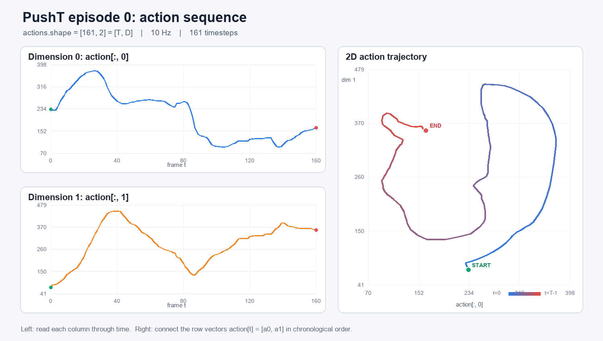
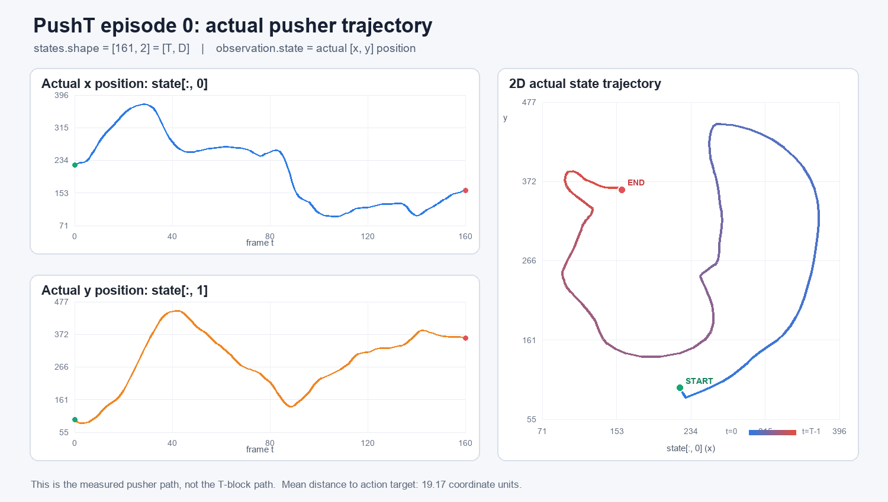

# Day 2：从一个 PushT episode 理解 `[T, D]` 和 trajectory

## 先看真实结果

这次直接读取本地的 `lerobot/pusht`，选择 **episode 0**。它包含 161 个连续 timestep，action 每一步有 2 个数，因此把整个 episode 的 action 按时间堆叠后得到：

```text
actions.shape = [161, 2] = [T, D]
```

- `T = 161`：时间长度，这个 episode 有 161 帧，`t = 0, 1, ..., 160`。
- `D = 2`：每一帧 action 有两个维度。
- 数据集频率是 10 Hz，因此这段 action 序列覆盖约 16.1 秒；最后一个样本的 timestamp 是 16.0 秒。



图来自本地数据集中的真实数值，并不是手工编造的示意图。

## 怎么读这张图

左上图固定第二个下标为 `0`，读取第一列：

```python
actions[:, 0]       # shape: [161]
```

也就是观察 action 的第 0 维怎样随时间变化。

左下图固定第二个下标为 `1`，读取第二列：

```python
actions[:, 1]       # shape: [161]
```

也就是观察 action 的第 1 维怎样随时间变化。

右图则是在每个时刻取一整行：

```python
actions[t]          # shape: [2]
```

把它当作二维 action space 中的一个点：

```text
(actions[t, 0], actions[t, 1])
```

再按照 `t = 0 → 1 → 2 → ... → 160` 的顺序把这些点连接，就得到右边的 **2D action trajectory**。蓝色是较早的 timestep，红色是较晚的 timestep；绿色点和红色点分别表示序列开始和结束。

## `[T, D]` 到底是什么

这个 tensor 可以想成一张表：每一行是一个时间点，每一列是一个 action 维度。

```text
                  D = 2 个动作维度
              dimension 0   dimension 1
t = 0             233            71
t = 1             229            83
t = 2             229            86
...                ...           ...
t = 160           164           355

T = 161 个 timestep
```

所以：

```text
actions[t, d]
        │  └── 第 d 个动作维度
        └───── 第 t 个时间点
```

常用切片的含义：

| 写法 | Shape | 含义 |
| --- | --- | --- |
| `actions` | `[161, 2]` | 整个 episode 的 action 序列 |
| `actions[t]` | `[2]` | 第 `t` 个时刻的完整 action |
| `actions[t, 0]` | 标量 | 第 `t` 个时刻 action 的第 0 维 |
| `actions[:, 0]` | `[161]` | 第 0 维在全部时间上的变化 |
| `actions[:, 1]` | `[161]` | 第 1 维在全部时间上的变化 |
| `actions[t0:t1]` | `[t1-t0, 2]` | 一段连续的 action trajectory |

最关键的阅读规则是：

> 横着读一行，得到某一时刻的动作；竖着读一列，得到某个动作维度随时间的变化。

## trajectory 是什么

单个时刻只有一个二维 action：

```text
a_t = [a_t,0, a_t,1]
```

把整个 episode 内的 action 按时间排列：

```text
a_0, a_1, a_2, ..., a_160
```

就得到一条 **action trajectory**。因此 trajectory 不是 tensor 中额外存在的特殊字段，而是“按时间顺序组织起来的一段数据”。

更完整的机器人 trajectory 通常还包括 observation：

```text
(o_0, a_0), (o_1, a_1), ..., (o_160, a_160)
```

本页只把其中的 action 部分拿出来画图。

### 一个必须分清的点

右图展示的是 **action trajectory**，不是 T 形物块自身的真实运动轨迹。

在经典 PushT 环境中，这两个 action 数值表示二维平面中推杆（agent）的目标坐标，可以理解为目标 `x/y`；所以把它们画成二维曲线很直观。不过它描述的是“每一步命令推杆去哪里”，推杆实际到了哪里应看 `observation.state`，T 形物块实际怎样运动则需要从图像或物块状态中追踪。

## `observation.state`：推杆的实际运动轨迹

下面继续使用同一个 **episode 0**，把每个 timestep 的 `observation.state` 按时间堆叠：

```text
states.shape = [161, 2] = [T, D]
```

在这个 PushT 数据集中，`observation.state` 的两个维度是推杆（agent）的实际二维位置，可以理解为实际 `[x, y]`。它不是 T 形物块的位置。



图的读法与 action 图完全相同：

- 左上：实际 `x` 位置 `states[:, 0]` 随时间的变化。
- 左下：实际 `y` 位置 `states[:, 1]` 随时间的变化。
- 右图：把每个 `states[t] = [x_t, y_t]` 按时间连接，得到推杆实际走过的二维路径。
- 蓝色到红色表示时间从 `t=0` 推进到 `t=160`。

episode 0 的实际 state 数值为：

```text
states.shape:    [161, 2]
起点 state:      [222.0, 97.0]
终点 state:      [158.33, 360.75]
各维最小值:       [93.70, 84.28]
各维最大值:       [373.73, 448.18]
```

### action 和 state 的区别

同一时刻可以同时看到“目标”和“实际位置”：

```text
t = 0
action[0] = [233.0, 71.0]   # 希望推杆去的位置
state[0]  = [222.0, 97.0]   # 此时测得的实际位置
```

因此：

```text
action trajectory = 控制目标按时间形成的轨迹
state trajectory  = 实际测得的位置按时间形成的轨迹
```

在这个 episode 中，每个 timestep 的 action 和 state 的二维欧氏距离平均约为：

```text
mean ||action[t] - state[t]||₂ = 19.17
```

两条轨迹整体形状相似，说明推杆在跟踪 action 给出的目标；但控制和物理运动不是瞬时完成的，所以两者并不完全相同。

> 更准确的术语：PushT 里这是二维推杆/agent 的实际轨迹。真实机械臂任务中，`observation.state` 可能是关节角、末端执行器位姿或两者的组合，必须根据具体数据集的 feature 定义判断，不能一律把它叫作 end-effector trajectory。

### state trajectory 的核心代码

```python
states = torch.stack(
    [dataset.hf_dataset[i]["observation.state"] for i in range(start, end)]
)

print(states.shape)       # torch.Size([161, 2])
print(states[0])          # tensor([222., 97.])
print(states[:, 0].shape) # 实际 x 随时间变化，shape [161]
print(states[:, 1].shape) # 实际 y 随时间变化，shape [161]
```

完整绘图程序是：

```text
week1/plot_pusht_state_trajectory.py
```

运行方式：

```powershell
C:\Users\77170\.conda\envs\lerobot\python.exe week1\plot_pusht_state_trajectory.py
```

## episode 0 的实际数据

本次读取结果：

```text
episode_id:             0
dataset index 范围:     [0, 161)
actions.shape:          [161, 2]
第一帧 action:          [233.0, 71.0]
最后一帧 action:        [164.0, 355.0]
各维最小值:             [93.0, 71.0]
各维最大值:             [375.0, 449.0]
最后一帧 next.done:     True
最后一帧 next.success:  False
```

`[0, 161)` 是 Python 常用的左闭右开区间：包含全局样本 0，不包含样本 161，所以一共有 `161 - 0 = 161` 条数据。全局样本 161 已经属于 episode 1。

`next.done=True` 表示 episode 已结束；`next.success=False` 表明该 episode 结束时任务没有成功。trajectory 和“成功轨迹”不是同义词：成功或失败的一次完整运行都可以形成 trajectory。

## 核心读取代码

下面几行完成了最重要的工作：先从元数据取得 episode 边界，再把每个 timestep 的 `[D]` action 堆叠为 `[T, D]`。

```python
import torch
from lerobot.datasets.lerobot_dataset import LeRobotDataset

dataset = LeRobotDataset(repo_id="lerobot/pusht")

episode_id = 0
episode = dataset.meta.episodes[episode_id]
start = int(episode["dataset_from_index"])
end = int(episode["dataset_to_index"])

# 每个 action 的 shape 是 [D]；沿时间堆叠后得到 [T, D]
actions = torch.stack(
    [dataset.hf_dataset[i]["action"] for i in range(start, end)]
)

print(actions.shape)       # torch.Size([161, 2])
print(actions[0])          # tensor([233.,  71.])
print(actions[:, 0].shape) # torch.Size([161])
print(actions[:, 1].shape) # torch.Size([161])
```

之所以使用 `dataset.hf_dataset[i]`，是因为这里只需要 parquet 中的 action，不需要同时解码每一帧视频，读取会快很多。

## 如何重新生成图

完整绘图程序保存在：

```text
week1/plot_pusht_action_trajectory.py
```

在当前安装了 LeRobot 的 conda 环境中运行：

```powershell
C:\Users\77170\.conda\envs\lerobot\python.exe week1\plot_pusht_action_trajectory.py
```

程序会重新读取 episode 0，并生成：

```text
week1/pusht_episode_0_action_trajectory.png
```

如果想看别的 episode，只需修改脚本顶部的：

```python
EPISODE_ID = 0
```

## 一句话总结

> `[T, D]` 就是 `T` 个连续时间点，每个时间点保存一个 `D` 维动作；沿时间依次读取这 `T` 行，就得到 action trajectory。

## 今日总结

今天通过 PushT 的 episode 0，把抽象的 `[T, D]` 变成了可以直接观察的轨迹：`T` 表示连续的时间步数，`D` 表示每个时间点的数据维度。将 161 个二维 action 按时间堆叠，得到 `[161, 2]` 的 action trajectory，表示控制器希望推杆去往的位置；将 161 个 `observation.state` 按时间堆叠，也得到 `[161, 2]` 的 state trajectory，表示推杆实际到达的位置。

今天最重要的认识是：

- 一行 `[D]` 是某一个时刻的完整数据，一列 `[T]` 是某个维度随时间的变化。
- trajectory 是把每个 timestep 的数据按照时间顺序连接起来。
- `action` 是控制目标，`observation.state` 是实际状态，二者相关但不完全相同。
- PushT 的 state trajectory 表示推杆的实际二维路径，不是 T 形物块自身的运动轨迹。
