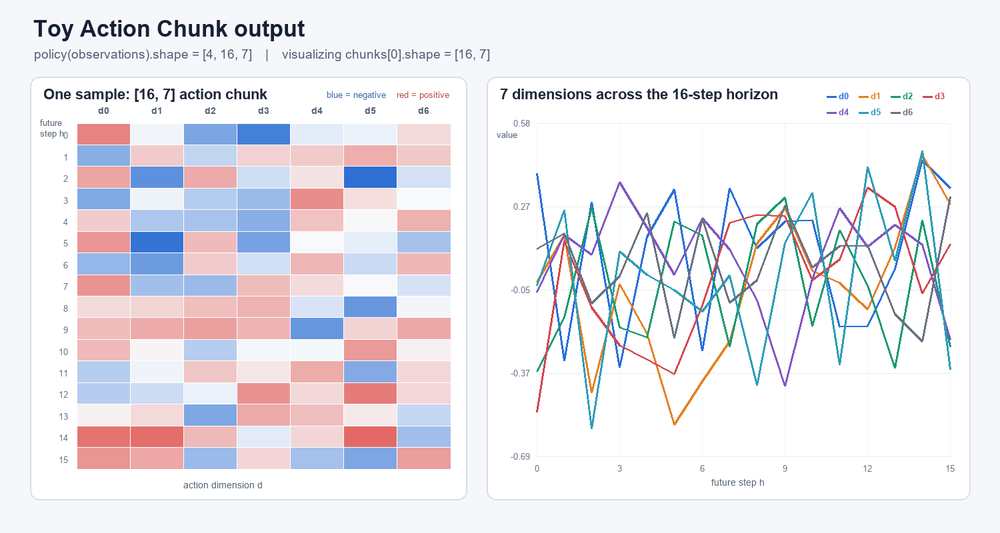

Day 3：Behavior Cloning
1.π(a_t | o_t) 到底是什么意思
给定状态下，产生这个对应动作的概率是多少。
2.总体流程
expert demonstration
        ↓
收集 (observation, action)
        ↓
supervised learning
        ↓
学习 policy π(a_t | o_t)
        ↓
部署到机器人
        ↓
action 改变环境
        ↓
产生新的 observation
        ↓
小误差可能不断积累
        ↓
distribution shift
        ↓
Behavior Cloning 性能下降
ACT路线
单步 action
π(a_t | o_t)

        ↓ 改为

action chunk
π(a_t:t+k | o_t)

        ↓

减少有效决策长度
+
Temporal Ensemble
每次预测多步，实际执行的步骤是多次预测的行动的加权融合的结果，最终得到真正执行的action。相对于是一个对时间步长的加权。
保持反馈修正

---

# Day 4：Action Chunk

## 结果先看

toy 程序已经实际运行，结果为：

```text
single_action.shape: torch.Size([4, 7])
action_chunk.shape:  torch.Size([4, 16, 7])
ensemble action:     torch.Size([7])
```

下面这张图展示 `action_chunk[0]`，它的 shape 是 `[16, 7]`：



左边是 `[16, 7]` 热力图，每一行代表一个未来 action；右边将 7 个 action 维度分别画成了跨越 16 个未来 timestep 的曲线。

> 如果当前是 VS Code 的 Markdown 源码编辑界面，只会看到 `` 这一行。请按 `Ctrl+Shift+V` 打开 Markdown 预览，或点击编辑器右上角的“打开侧边预览”，即可看到图片。

## 今日目标

今天要理解：策略不一定只预测下一步 action，也可以一次预测一小段未来动作。

```text
单步预测：     π(o_t) → a_t
Action Chunk：π(o_t) → [a_t, a_{t+1}, ..., a_{t+15}]
```

假设机器人每个 action 有 7 个维度：

```text
单步 action： [B, 7]
action chunk：[B, 16, 7]
```

- `B`：batch size，一次处理的样本数量。
- `16`：chunk size，一次预测 16 个连续 action。
- `7`：每个 action 的维度，例如 6 个关节维度加 1 个夹爪维度。

## 1. 什么是 Action Chunk

单步策略看到当前 observation `o_t` 后，只预测下一步动作：

```text
o_t → a_t
```

Action Chunk 策略看到 `o_t` 后，一次预测未来连续的 16 个动作：

```text
o_t → [a_t, a_{t+1}, ..., a_{t+15}]
```

对应 tensor 为：

```text
actions.shape = [B, 16, 7]
                 │   │  │
                 │   │  └── 每个 timestep 的 action 维度
                 │   └───── 16 个连续 timestep
                 └───────── B 条样本
```

对于第 `b` 条样本：

```python
actions[b]        # [16, 7]：完整的 action chunk
actions[b, 0]     # [7]：chunk 中第一个 action
actions[b, 15]    # [7]：chunk 中最后一个 action
actions[b, h, d]  # 标量：第 h 个未来时刻的第 d 个动作维度
```

这 16 个 action 不是把同一个 action 复制 16 遍，而是模型针对 16 个未来时间位置分别预测的动作。

## 2. Chunk Size 和 Horizon

### Chunk Size

`chunk size` 表示策略一次输出多少个连续 action。本例中：

```text
chunk_size = 16
```

### Horizon

`horizon` 表示向未来考虑多远，但需要根据上下文区分：

- **Prediction horizon**：一次向未来预测多少步，本例为 16。
- **Execution horizon**：预测后连续执行多少步，才重新观察和预测。
- **Episode horizon**：一个完整 episode 最多允许持续多少步。

在本例中可以记为：

```text
预测长度 H = 16
执行长度 E ≤ H
```

`H=16` 并不代表一定要把 16 步全部执行完。预测多少步和真正连续执行多少步，是两个不同的选择。

## 3. Toy 示例：从 `[B, 7]` 改为 `[B, 16, 7]`

### 修改前：只预测一个 action

```python
import torch
from torch import nn

B = 4
OBS_DIM = 32
ACTION_DIM = 7


class SingleStepPolicy(nn.Module):
    def __init__(self):
        super().__init__()
        self.encoder = nn.Sequential(
            nn.Linear(OBS_DIM, 64),
            nn.ReLU(),
        )
        self.action_head = nn.Linear(64, ACTION_DIM)

    def forward(self, observation):
        feature = self.encoder(observation)
        return self.action_head(feature)


observations = torch.randn(B, OBS_DIM)
policy = SingleStepPolicy()
actions = policy(observations)

print(actions.shape)  # torch.Size([4, 7])
```

原来的输出层只输出 7 个数：

```python
nn.Linear(64, 7)
```

### 修改后：一次预测 16 个 action

```python
import torch
from torch import nn

B = 4
OBS_DIM = 32
ACTION_DIM = 7
CHUNK_SIZE = 16


class ActionChunkPolicy(nn.Module):
    def __init__(self):
        super().__init__()
        self.encoder = nn.Sequential(
            nn.Linear(OBS_DIM, 64),
            nn.ReLU(),
        )
        self.action_head = nn.Linear(
            64,
            CHUNK_SIZE * ACTION_DIM,
        )

    def forward(self, observation):
        feature = self.encoder(observation)

        # 先输出 [B, 16 * 7] = [B, 112]
        flat_actions = self.action_head(feature)

        # 再把 112 拆成 16 个 7 维 action
        action_chunk = flat_actions.reshape(
            observation.shape[0],
            CHUNK_SIZE,
            ACTION_DIM,
        )
        return action_chunk


observations = torch.randn(B, OBS_DIM)
policy = ActionChunkPolicy()
actions = policy(observations)

print(actions.shape)  # torch.Size([4, 16, 7])
```

核心变化只有两步：

```text
1. 输出层：7 → 16 × 7 = 112
2. reshape：[B, 112] → [B, 16, 7]
```

训练标签也要从单步 action `[B, 7]` 改成未来 16 步 expert action `[B, 16, 7]`：

```python
predicted_chunk = policy(observations)  # [B, 16, 7]
expert_chunk = torch.randn(B, 16, 7)    # toy label

loss = nn.functional.mse_loss(
    predicted_chunk,
    expert_chunk,
)
loss.backward()
```

真实数据中的一条训练样本可以理解为：

```text
输入：o_t
标签：[a_t, a_{t+1}, ..., a_{t+15}]
```

模型没有看到未来 observation，而是通过 expert demonstration 学习：给定当前 observation，接下来通常应该怎样连续行动。

## 4. 预测出的 16 个 action 如何执行

策略虽然一次输出 `[B, 16, 7]`，但机器人控制器在每个 timestep 通常仍然只接收一个 `[B, 7]` action。

如何使用这 16 个 action，取决于下面的执行方式。

### 4.1 Open-loop Execution

Open-loop execution 是预测一次后，不调用 policy 重新规划，直接连续执行整个 chunk：

```text
t=0：观察 o_0，预测 [a_0, a_1, ..., a_15]
     执行 a_0
t=1：执行 a_1
t=2：执行 a_2
...
t=15：执行 a_15
t=16：取得新的 observation，再预测下一个 chunk
```

此时：

```text
H = 16
E = 16
```

优点：

- policy 推理次数较少。
- 一次生成的局部动作比较连贯。

缺点：

- 执行期间无法根据新 observation 重新规划。
- 如果发生扰动或前面的 action 出现误差，后面的计划可能不再合适。

这里的 open-loop 是指执行 chunk 期间不重新调用 policy，并不是环境不再变化，也不是传感器停止产生 observation。

### 4.2 Receding Horizon

Receding horizon 是每次预测 16 步，但只执行前几步，然后根据新的 observation 再次预测。

例如每次只连续执行 4 步：

```text
t=0：根据 o_0 预测 [a_0, ..., a_15]，执行前 4 步
t=4：根据 o_4 预测 [a_4, ..., a_19]，执行前 4 步
t=8：根据 o_8 预测 [a_8, ..., a_23]，执行前 4 步
```

此时：

```text
H = 16
E = 4
```

它可以理解为：始终向前规划 16 步，但每走 4 步就根据实际情况重新画路线。

- `E` 越小，反馈修正越频繁，但 policy 推理次数越多。
- `E` 越大，推理次数越少，但计划更容易过时。
- 当 `E=1` 时，每个 timestep 都重新观察并预测一个新 chunk。

## 5. Temporal Ensemble

如果每个 timestep 都预测一个长度为 16 的 chunk，那么不同时间生成的 chunk 会对同一个未来时刻产生重叠预测。

例如在 `t=2` 时：

```text
t=0 生成的 chunk：第 2 个位置预测 a_2
t=1 生成的 chunk：第 1 个位置预测 a_2
t=2 生成的 chunk：第 0 个位置预测 a_2
```

因此，当前 `a_2` 有 3 个候选预测。Temporal Ensemble 不只选择其中一个，而是将这些候选 action 加权融合：

```text
执行的 a_2 = w_0 · â_2^(t=0)
           + w_1 · â_2^(t=1)
           + w_2 · â_2^(t=2)
```

权重归一化后满足：

```text
w_0 + w_1 + w_2 = 1
```

一般可以让较新的预测拥有更大的权重。一个简单 toy 实现如下：

```python
import math
import torch


def temporal_ensemble(chunk_history, current_t, decay=0.25):
    candidates = []
    weights = []

    # chunk_history 中每一项为：
    # (chunk 的生成时刻, shape 为 [16, 7] 的 chunk)
    for prediction_t, chunk in chunk_history:
        offset = current_t - prediction_t

        # 判断这个 chunk 是否包含对 current_t 的预测
        if 0 <= offset < chunk.shape[0]:
            candidates.append(chunk[offset])
            weights.append(math.exp(-decay * offset))

    candidates = torch.stack(candidates)  # [N, 7]
    weights = torch.tensor(weights)        # [N]
    weights = weights / weights.sum()

    # 最终交给环境的仍然只是一个 7 维 action
    action = (candidates * weights[:, None]).sum(dim=0)
    return action                         # [7]
```

Temporal Ensemble 的主要作用：

- 融合多个时间点对当前 action 的预测。
- 减少单次预测的噪声，使动作更平滑。
- 每个 timestep 仍然可以读取新 observation，保留反馈修正能力。

它主要适用于可以加权平均的连续 action。离散 action 通常需要融合概率、logits 或投票结果，不能直接平均动作编号。

## 6. 三种执行方式对比

| 方法 | 一个例子 | 重新规划频率 | 特点 |
| --- | --- | --- | --- |
| Open-loop | `H=16, E=16` | 每 16 步 | 推理少，但计划容易因误差而过时 |
| Receding horizon | `H=16, E=4` | 每 4 步 | 在推理成本和反馈修正之间折中 |
| Temporal ensemble | `H=16, E=1`，并融合重叠预测 | 每一步 | 反馈及时，并利用多个 chunk 平滑动作 |

Temporal Ensemble 可以理解为：在每步 receding-horizon 执行的基础上，进一步利用历史 chunk 的重叠预测。它和 receding horizon 并不是完全互斥的概念。

## 7. 一次预测多个 action 有什么意义

### 学习连贯的局部动作

许多机器人行为不是孤立的一步，而是一段具有结构的动作：

```text
靠近物体 → 对准 → 闭合夹爪 → 抬起
```

一次预测多个 action，可以让模型直接学习这些连续动作之间的关系。

### 缩短有效决策长度

假设一个任务包含 160 个 timestep：

```text
单步决策：大约需要做 160 次局部决策
16 步 chunk 完全 open-loop：大约需要做 10 次 chunk 决策
```

这就是 Action Chunk “减少有效决策长度”的直观含义。不过，当 execution horizon 小于 16 时，实际重新规划次数会更多。

### 减少模型推理开销

如果机器人允许连续执行 chunk 的一部分，就不必在每个控制周期都完整运行一次大模型。

### 仍然可以保留反馈

Action Chunk 不等于放弃反馈：

- Receding horizon 通过定期重新预测修正误差。
- Temporal Ensemble 可以每步重新预测，并融合重叠 chunk 的结果。

## 8. 完整可运行示例

完整 toy 程序保存在：

```text
week1/action_chunk_toy.py
```

运行命令：

```powershell
C:\Users\77170\.conda\envs\lerobot\python.exe week1\action_chunk_toy.py
```

关键输出：

```text
single_action.shape: torch.Size([4, 7])
action_chunk.shape:  torch.Size([4, 16, 7])
ensemble action:     torch.Size([7])
```

这里再次说明：policy 一次预测了 16 个 action，但当前 timestep 真正交给环境执行的仍然是一个 7 维 action。

## 9. Action Chunk 结果图

下面是 toy policy 实际输出的一个 action chunk。程序首先生成完整输出：

```text
chunks.shape = [4, 16, 7]
```

然后取 batch 中的第 0 条样本：

```python
sample_chunk = chunks[0]
print(sample_chunk.shape)  # [16, 7]
```


### 如何读左边的热力图

左图就是一个 `[16, 7]` 矩阵：

- 从上到下的 16 行对应未来的 `h=0, 1, ..., 15`。
- 从左到右的 7 列对应 action 的 `d=0, 1, ..., 6`。
- 每个格子表示 `sample_chunk[h, d]`。
- 红色表示正值，蓝色表示负值，颜色越深代表绝对值越大。

横着读一行：

```python
sample_chunk[h]  # [7]
```

得到第 `h` 个未来 timestep 的完整 action。

竖着读一列：

```python
sample_chunk[:, d]  # [16]
```

得到第 `d` 个 action 维度在未来 16 步中的变化。

### 如何读右边的折线图

右图把 7 列分别画成 7 条曲线：

```text
横轴：future step h，共 16 步
纵轴：预测的 action value
每条线：一个 action dimension
```

因此，热力图和折线图展示的是同一个 `[16, 7]` tensor，只是观察方向不同。

> 这张图来自固定随机种子的未训练 toy policy，只用于解释 tensor shape 和 action chunk 的结构。曲线本身还不具有真实机器人的动作含义；真实训练完成后，图中应该是模型根据 observation 预测出的连续动作。

生成图片的程序保存在：

```text
week1/plot_action_chunk_toy.py
```

运行方式：

```powershell
C:\Users\77170\.conda\envs\lerobot\python.exe week1\plot_action_chunk_toy.py
```

## 今日总结

- Action Chunk 是根据当前 observation，一次预测未来的一段连续动作。
- `[B, 16, 7]` 表示 `B` 条样本，每条样本包含 16 个连续的 7 维 action。
- Chunk size 或 prediction horizon 决定预测多远，execution horizon 决定执行几步后重新预测。
- Open-loop 连续执行整个 chunk；receding horizon 只执行前几步便重新规划。
- Temporal Ensemble 对多个重叠 chunk 在当前时刻的预测进行加权融合。
- 一次预测多个 action 可以学习更连贯的局部动作、缩短有效决策长度，并减少推理开销。
